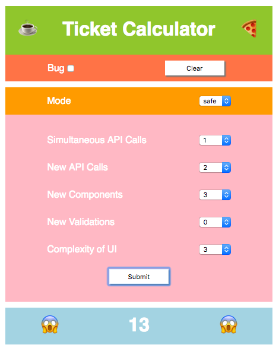

# Ticket Calculator
Simple Calculator for estimating tickets.

### Mode
Depending on Mode ("safe" or "yolo"), 
the calculator aproximates the value 
to the nearest fibonacci number between 1 and 13.

### Emojis based on point score

0: "bug"

1: "sunglasses"

2: "grinning"

3: "slightly_smiling_face"

5: "no_mouth"

8: "cold_sweat"

13: "scream"

13+: "no_good"

### Example

### To run app locally

`npm i`

`npm start`